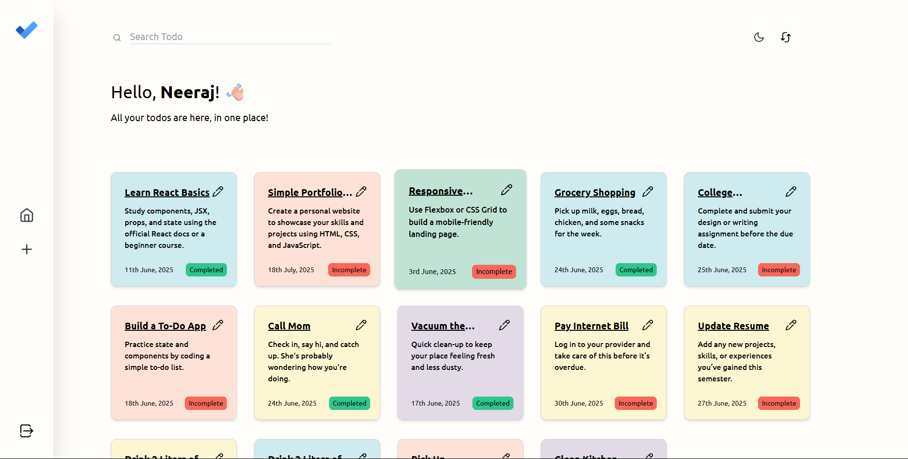
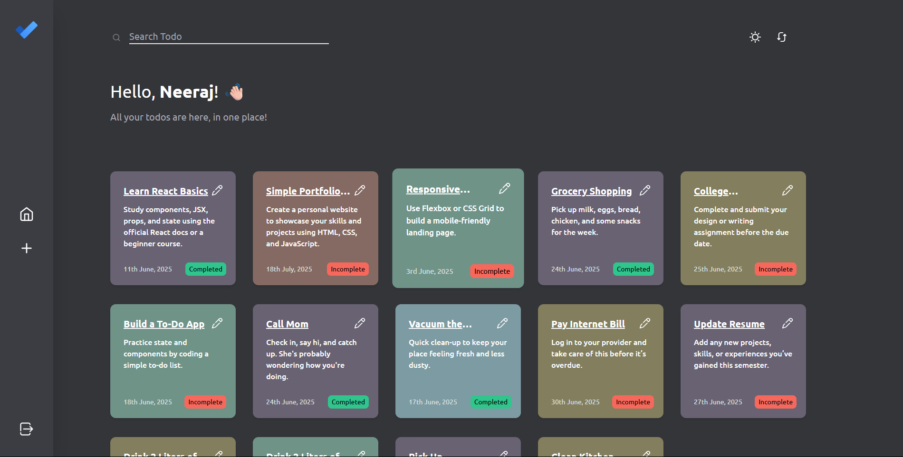

# 📝 TodoApp

A modern, responsive Todo List web application built by using MERN Stack. Users can add, edit, complete, and delete tasks with an intuitive interface. Dark mode support included!

> 🚀 Live at [this link](https://todoapp-mocha-omega.vercel.app/signin) feel free to check it out!

---

## 📸 Screenshots

| Light Mode | Dark Mode |
|------------|-----------|
|  |  |

---

## ✨ Features

- ✅ User Authentication (Sign Up, Sign In)
- 📅 Add tasks with due dates using a date picker
- 📝 Edit and update tasks
- 🗑️ Delete tasks
- ☑️ Mark tasks as completed
- 🌙 Light & Dark mode toggle
- 📱 Responsive UI for mobile and desktop
- 🔐 Secure session handling (JWT-based)
- 🧭 Navigate between Sign In / Sign Up / Home
- 📦 Backend connected to MongoDB (via Mongoose)

---

## 🔧 Tech Stack & Tools Used

  

  

  

---

## 🛠️ Upcoming Todos

- ⬜ Add drag-and-drop feature for reordering todos
- ⬜ Task categories or tags
- ⬜ Add search functionality
- ⬜ Enable user profile management
- ⬜ Add toast notifications

---

## 🙋‍♂️ Author

Neeraj Sharma  
📧 neerajsky704@gmail.com  
🔗 [LinkedIn](https://www.linkedin.com/in/neeraj-80876432b)
